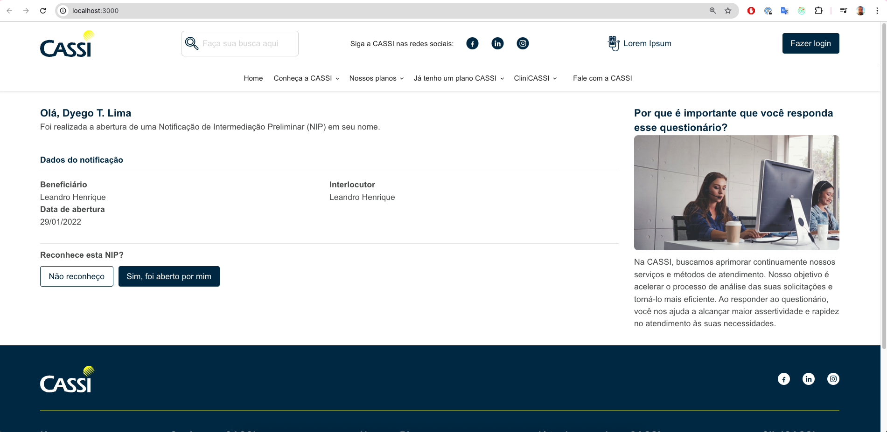
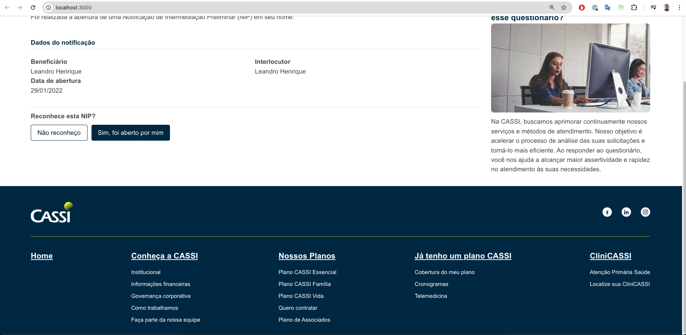
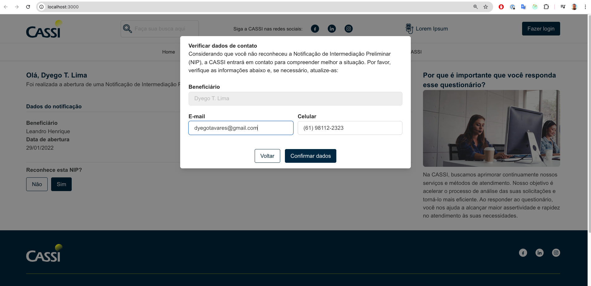
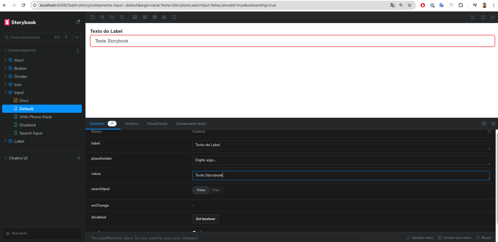
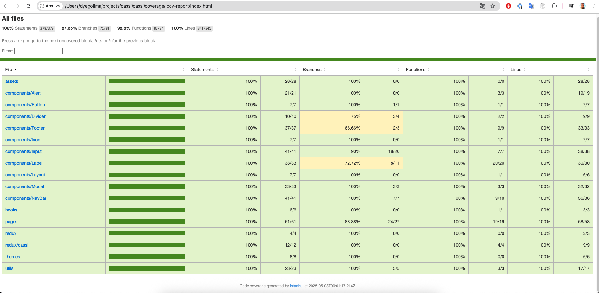

# 📘 Cassi

Projeto desenvolvido como parte do processo seletivo da **CASSI Institucional**.  
O objetivo é demonstrar conhecimentos técnicos em **Server Side Rendering**, **componentização**, **lógica de programação**, **gestão de estado**, entre outros aspectos fundamentais no desenvolvimento frontend moderno.

> ⚠️ **Observação**: Algumas tecnologias como `Redux` e `styled-components` foram utilizadas propositalmente, mesmo que não fossem estritamente necessárias para um projeto deste porte. Isso foi feito com o intuito de demonstrar domínio técnico e boas práticas com essas ferramentas.

> ℹ️ **Observação adicional**: O projeto não contempla `breakpoints` responsivos, pois essa exigência não foi especificada no escopo do desafio. Recomenda-se visualizá-lo preferencialmente na resolução de **1280x800** para melhor experiência.  
> Além disso, recomenda-se utilizar o `Node.js` na versão **v18.20.6** para garantir total compatibilidade com as dependências utilizadas.

---

## 🚀 Tecnologias Utilizadas

- [React](https://reactjs.org/)
- [Next.js](https://nextjs.org/)
- [TypeScript](https://www.typescriptlang.org/)
- [Chakra UI](https://chakra-ui.com/)
- [Styled Components](https://styled-components.com/)
- [Redux Toolkit](https://redux-toolkit.js.org/)
- [Storybook](https://storybook.js.org/)
- [Jest](https://jestjs.io/)
- [TurboRepo](https://turbo.build/repo)

---

## 🎯 Motivação

A proposta da aplicação é servir como um pequeno **webpage demonstrativo** no contexto do processo seletivo da CASSI. A ideia foi desenvolver uma base sólida e escalável, mesmo em um projeto reduzido, como forma de mostrar domínio técnico em diferentes camadas da stack frontend.

---

## 🧠 Desafios Técnicos

- Organização escalável de componentes e hooks
- Implementação de temas com Chakra UI + styled-components
- Gerenciamento de estado com Redux Toolkit
- Escrita de testes com Jest e React Testing Library
- Criação de documentação de componentes com Storybook

---

## 🖥️ Como rodar o projeto localmente

```bash
npm install       # Instala as dependências
npm run dev       # Inicia o servidor local na porta 3000
```

---

## ✅ Rodando os testes

```bash
npm run test         # Executa os testes
npm run coverage     # Gera o relatório de cobertura de testes
npm run test:watch   # Executa testes em modo de observação
```

---

## 📚 Visualização dos Componentes com Storybook

```bash
npm run storybook    # Inicia o Storybook na porta 6006
```

---

## 📁 Estrutura de Pastas

```
src/
├── assets/             # Imagens e arquivos estáticos
├── components/         # Componentes reutilizáveis (Button, Input, Modal, etc.)
├── hooks/              # Hooks customizados e integrações com Redux
├── pages/              # Páginas da aplicação (estrutura do Next.js)
├── redux/              # Store do Redux e slices (ex: cassi/)
├── themes/             # Tema do Chakra UI e paleta de cores
├── utils/              # Arquivos utilitários como Enums, máscaras e regex
├── tests/              # Testes dos componentes com estrutura espelhada ao src
├── stories/            # Configurações e estrutura do Storybook
```

---

## 🖼️ Screenshots do Projeto

> ⚠️ **Screenshots de partes do projeto.**  
>
>   
>   
>   
>   
>   


---

## 👨‍💻 Autor

**Dyego Tavares Lima**  
Desenvolvedor Front-end

[LinkedIn](https://www.linkedin.com/in/dyegotlima/) | [GitHub](https://github.com/colzerah)

---


